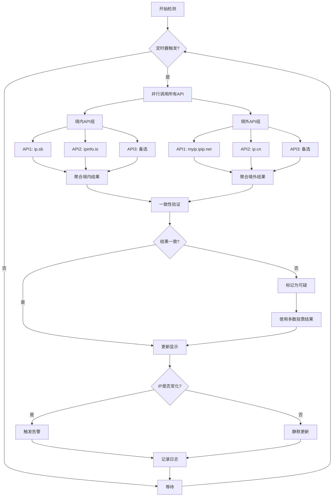
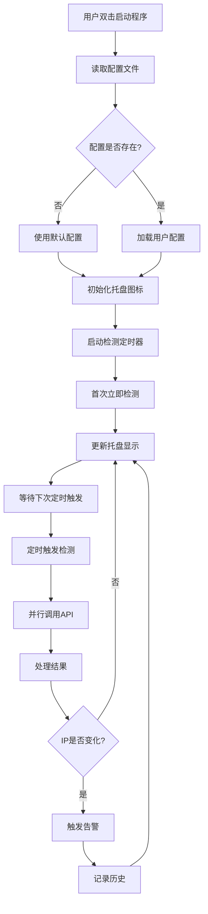

# 实时IP监测工具 - 产品需求文档 (PRD)

**文档版本**: v1.0
**创建日期**: 2026-06-11
**产品经理**: [待填写]
**状态**: 待评审

---

## 目录

1. [产品概述](#1-产品概述)
2. [用户故事](#2-用户故事)
3. [功能需求](#3-功能需求)
4. [非功能需求](#4-非功能需求)
5. [UI/UX设计说明](#5-uiux设计说明)
6. [API策略设计](#6-api策略设计)
7. [配置项说明](#7-配置项说明)
8. [技术架构建议](#8-技术架构建议)

---

## 1. 产品概述

### 1.1 产品定位

**实时IP监测工具** 是一款面向Windows桌面用户的轻量级网络出口IP监测应用。通过系统托盘常驻运行，实时监控当前网络出口IP地址及其地理位置归属（境内/境外），帮助用户及时发现VPN/代理不稳定导致的IP切换问题，避免因IP异常被Anthropic、OpenAI等平台封号。

### 1.2 目标用户

| 用户类型 | 特征描述 | 核心诉求 |
|---------|---------|---------|
| **AI服务重度使用者** | 长期使用ChatGPT、Claude等境外AI服务 | 确保IP稳定在目标地区，防止因IP切换导致账号异常 |
| **跨境工作者** | 需要同时访问境内外网络资源 | 监控当前IP状态，确保业务连续性 |
| **VPN/代理用户** | 使用梯子或企业VPN上网 | 及时发现连接不稳定导致的IP漂移 |
| **安全敏感型用户** | 关注网络安全和隐私保护 | 了解自身网络出口的真实情况 |

### 1.3 产品价值

- **预防性监控**: 主动检测IP变化，而非被动等待封号通知
- **双通道验证**: 通过境内+境外API交叉验证，提高判断准确性
- **零打扰设计**: 系统托盘常驻，不占用工作空间
- **即时告警**: IP变化时立即通过多种方式提醒用户

### 1.4 核心使用场景

```
场景1: AI平台使用保障
用户正在使用ChatGPT进行重要对话 → VPN突然断开 → IP从美国切换到中国
→ 工具立即弹窗告警 + 声音提示 → 用户及时处理，避免账号被标记

场景2: 多地区切换监控
用户需要在不同时间段切换不同地区的IP（如白天用日本IP，晚上用美国IP）
→ 工具记录每次切换的时间和IP详情 → 方便排查问题

场景3: 代理稳定性测试
用户更换了新的VPN服务商 → 开启工具持续监测24小时
→ 查看历史记录统计IP切换频率 → 评估服务质量
```

---

## 2. 用户故事

### 2.1 核心用户故事

#### US-001: 实时查看IP状态
**作为** 一个AI服务的日常用户  
**我希望** 在任务栏托盘中随时看到当前的IP状态（境内/境外）  
**以便于** 我能快速确认网络是否正常，无需打开浏览器查询

**验收标准:**
- [ ] 托盘图标显示两行文字信息
- [ ] 第一行显示境内检测结果（IP + 地理位置）
- [ ] 第二行显示境外检测结果（IP + 国家/地区）
- [ ] 信息每N秒自动更新一次（可配置）

#### US-002: 配置监测参数
**作为** 一个有特定需求的用户  
**我希望** 能够自定义检测间隔时间、选择使用的API端点、设置告警方式  
**以便于** 我可以根据自己的网络环境和使用习惯调整工具行为

**验收标准:**
- [ ] 可配置检测间隔（支持5-3600秒范围）
- [ ] 可自定义境内检测API列表（至少提供3个默认选项）
- [ ] 可自定义境外检测API列表（至少提供3个默认选项）
- [ ] 可选择告警方式：声音/弹窗/颜色标识/组合

#### US-003: 接收变化告警
**作为** 一个担心IP切换的用户  
**我希望** 当检测到IP发生变化时能够立即收到告警  
**以便于** 我可以第一时间采取措施（重连VPN、暂停操作等）

**验收标准:**
- [ ] IP变化时触发告警（可配置延迟防抖）
- [ ] 支持声音提示（可选系统音效或自定义音频文件）
- [ ] 支持桌面弹窗通知（显示新旧IP对比）
- [ ] 托盘图标颜色变化标识（绿色=正常，黄色=警告，红色=异常）
- [ ] 告警历史记录可查看

#### US-004: 查看详细信息
**作为** 一个需要排查问题的用户  
**我希望** 双击托盘图标能看到完整的IP信息和历史记录  
**以便于** 我能分析IP变化的规律和原因

**验收标准:**
- [ ] 双击打开详细窗口
- [ ] 显示当前完整IP信息（多个API的返回结果）
- [ ] 显示历史记录列表（时间、IP、位置、变化类型）
- [ ] 支持导出历史记录（CSV格式）
- [ ] 支持清空历史记录

#### US-005: 手动控制功能
**作为一个注重效率的用户  
**我希望** 能通过右键菜单快速执行常用操作  
**以便于** 我无需进入设置界面就能完成基本操作

**验收标准:**
- [ ] 右键菜单包含：设置、手动刷新、退出选项
- [ ] 手动刷新立即调用所有API更新显示
- [ ] 退出时有确认提示（防止误操作）
- [ ] 设置页面可直接从右键菜单打开

### 2.2 次要用户故事

#### US-006: 启动自动运行
**作为** 一个希望工具始终可用的用户  
**我希望** 工具可以在系统启动时自动运行  
**以便于** 我不需要每次开机都手动启动

**验收标准:**
- [ ] 设置中提供"开机自启"选项（默认关闭）
- [ ] 选择后写入注册表启动项
- [ ] 可以随时取消自启

#### US-007: 最小化资源占用
**作为** 一个关注系统性能的用户  
**我希望** 工具占用最少的系统资源（内存、CPU、网络带宽）  
**以便于** 它不会影响我的正常工作和电脑性能

**验收标准:**
- [ ] 空闲时内存占用 < 50MB
- [ ] CPU占用 < 1%（检测间隔期间）
- [ ] 单次检测请求大小 < 10KB
- [ ] 支持后台静默运行模式

---

## 3. 功能需求

### 3.1 功能优先级定义

| 优先级 | 定义 | 说明 |
|-------|------|------|
| **P0 - 必须实现** | MVP核心功能 | 无此功能则产品不可用 |
| **P1 - 应该实现** | 重要增强功能 | 大幅提升用户体验 |
| **P2 - 可以实现** | 锦上添花功能 | 有则更好，无也可接受 |

### 3.2 功能清单

#### 3.2.1 系统托盘模块 (P0)

| 功能ID | 功能名称 | 详细描述 | 优先级 |
|--------|---------|---------|-------|
| F-001 | 托盘图标显示 | 在Windows系统托盘区域显示应用图标 | P0 |
| F-002 | 双行文本显示 | 图标旁显示两行文字：第一行境内状态，第二行境外状态 | P0 |
| F-003 | 文本内容格式 | 格式：`[境内/境外] IP地址 - 地理位置` | P0 |
| F-004 | 文本长度限制 | 每行最多显示30个字符，超出部分省略号截断 | P1 |
| F-005 | 图标状态指示 | 正常(绿)、警告(黄)、错误(红)三种状态图标 | P1 |

**详细规格:**

```
托盘显示示例:

正常状态:
┌─────────────────────┐
│ 🟢 CN: 116.123.45.67 - 北京    │
│ 🟢 US: 54.234.12.98 - Virginia │
└─────────────────────┘

异常状态(IP切换):
┌─────────────────────┐
│ 🔴 CN: 116.123.45.67 - 北京    │
│ 🔴 US: ⚠ 切换至中国           │
└─────────────────────┘
```

#### 3.2.2 IP检测引擎 (P0)

| 功能ID | 功能名称 | 详细描述 | 优先级 |
|--------|---------|---------|-------|
| F-010 | 境内IP检测 | 调用国内API获取出口IP及地理位置 | P0 |
| F-011 | 境外IP检测 | 调用国际API获取出口IP及国家地区 | P0 |
| F-012 | 多API交叉验证 | 同时调用多个API，结果一致性校验 | P0 |
| F-013 | 结果解析 | 解析API返回的JSON/文本数据 | P0 |
| F-014 | 归属地判断 | 根据IP或地理位置判断是境内还是境外 | P0 |
| F-015 | 异常处理 | API超时、失败时的降级策略 | P1 |
| F-016 | 缓存机制 | 相同IP短时间内不重复请求 | P2 |

**检测流程:**



#### 3.2.3 告警系统 (P0)

| 功能ID | 功能名称 | 详细描述 | 优先级 |
|--------|---------|---------|-------|
| F-020 | 变化检测 | 对比前后两次IP检测结果 | P0 |
| F-021 | 声音告警 | 播放提示音（系统音效或自定义） | P1 |
| F-022 | 弹窗告警 | Windows桌面通知，显示变化详情 | P1 |
| F-023 | 颜色标识 | 托盘图标颜色变化 | P1 |
| F-024 | 防抖机制 | 变化后N秒内不重复告警（可配置） | P1 |
| F-025 | 告警级别 | 区分：信息(切换)、警告(不一致)、错误(无法检测) | P2 |

**告警规则:**

| 场景 | 告警级别 | 默认动作 | 可配置项 |
|-----|---------|---------|---------|
| IP从境内→境外 | 信息 | 弹窗+声音 | ✓ |
| IP从境外→境内 | 警告 | 弹窗+声音+红色图标 | ✓ |
| IP在同一区域内变化 | 信息 | 仅弹窗 | ✓ |
| 所有API返回不一致 | 警告 | 黄色图标+弹窗 | ✓ |
| 所有API请求失败 | 错误 | 红色图标+声音 | ✓ |
| 恢复正常 | 信息 | 绿色图标 | ✓ |

#### 3.2.4 设置界面 (P1)

| 功能ID | 功能名称 | 详细描述 | 优先级 |
|--------|---------|---------|-------|
| F-030 | 基本设置页 | 检测间隔、开机自启等基础配置 | P1 |
| F-031 | API配置页 | 自定义境内/境外API端点列表 | P1 |
| F-032 | 告警设置页 | 告警方式、声音选择、防抖时间等 | P1 |
| F-033 | 高级设置页 | 日志级别、代理设置、调试模式 | P2 |
| F-034 | 配置导入导出 | 导出/导入配置文件（JSON格式） | P2 |
| F-035 | 恢复默认值 | 一键恢复所有设置为默认值 | P2 |

**设置界面布局草图:**

```
┌──────────────────────────────────────────────────────┐
│  IP Monitor 设置                              [_][×] │
├──────────────────────────────────────────────────────┤
│  [基本设置]  [API配置]  [告警设置]  [高级设置]        │
├──────────────────────────────────────────────────────┤
│                                                      │
│  ● 检测间隔: [  30  ] 秒  (范围: 5-3600)            │
│                                                      │
│  ☑ 开机自启                                          │
│                                                      │
│  ☐ 启动时最小化到托盘                                 │
│                                                      │
│  语言: [简体中文 ▼]                                   │
│                                                      │
│                                    [恢复默认] [确定]   │
└──────────────────────────────────────────────────────┘
```

#### 3.2.5 详情窗口 (P1)

| 功能ID | 功能名称 | 详细描述 | 优先级 |
|--------|---------|---------|-------|
| F-040 | 主面板显示 | 当前IP完整信息展示 | P1 |
| F-041 | 多API结果显示 | 展示每个API的独立返回结果 | P1 |
| F-042 | 历史记录列表 | 时间线形式展示历史检测记录 | P1 |
| F-043 | 记录筛选 | 按时间范围、变化类型筛选 | P2 |
| F-044 | 导出功能 | 导出为CSV/JSON格式 | P2 |
| F-045 | 清空记录 | 一键清空历史记录（需确认） | P2 |

**详情窗口布局草图:**

```
┌──────────────────────────────────────────────────────────────────┐
│  IP Monitor - 详细信息                                  [_][×][—]│
├──────────────────────────────────────────────────────────────────┤
│                                                                  │
│  ┌─ 当前状态 ──────────────────────────────────────────────────┐ │
│  │  境内检测                                                    │ │
│  │  ├─ IP地址: 116.123.45.67                                   │ │
│  │  ├─ 地理位置: 北京市 朝阳区                                  │ │
│  │  ├─ 运营商: 中国电信                                         │ │
│  │  └─ 更新时间: 2026-06-11 14:32:15                           │ │
│  │                                                              │ │
│  │  境外检测                                                    │ │
│  │  ├─ IP地址: 54.234.12.98                                    │ │
│  │  ├─ 国家/地区: United States, Virginia                       │ │
│  │  ├─ ISP: Amazon.com, Inc.                                   │ │
│  │  └─ 更新时间: 2026-06-11 14:32:16                           │ │
│  └──────────────────────────────────────────────────────────────┘ │
│                                                                  │
│  ┌─ 各API返回详情 ─────────────────────────────────────────────┐ │
│  │  API名称              IP地址          位置         状态     │ │
│  │  ip.sb                54.234.12.98    US-Virginia  ✓        │ │
│  │  ipinfo.io            54.234.12.98    US-Virginia  ✓        │ │
│  │  ip-api.com           54.234.12.98    US-Virginia  ✓        │ │
│  │  myip.ipip.net        116.123.45.67   北京朝阳      ✓        │ │
│  │  ip.cn                116.123.45.67   北京电信      ✓        │ │
│  └──────────────────────────────────────────────────────────────┘ │
│                                                                  │
│  ┌─ 历史记录 ──────────────────────────────────────────────────┐ │
│  │  时间                 类型    旧IP            新IP       操作│ │
│  │  2026-06-11 14:30:22  切换    54.234.12.98   116.123...  [详情]│ │
│  │  2026-06-11 14:28:05  正常    54.234.12.98   54.234....  [详情]│ │
│  │  2026-06-11 14:25:33  切换    116.123.45.67  54.234....  [详情]│ │
│  │                                                              │ │
│  │                              [导出CSV] [清空记录]            │ │
│  └──────────────────────────────────────────────────────────────┘ │
│                                                                  │
│                                              [刷新] [最小化] [关闭]│
└──────────────────────────────────────────────────────────────────┘
```

#### 3.2.6 右键菜单 (P0)

| 功能ID | 功能名称 | 详细描述 | 优先级 |
|--------|---------|---------|-------|
| F-050 | 菜单弹出 | 右键点击托盘图标显示上下文菜单 | P0 |
| F-051 | 打开详情 | 菜单项：打开详情窗口 | P0 |
| F-052 | 打开设置 | 菜单项：打开设置界面 | P1 |
| F-053 | 手动刷新 | 菜单项：立即执行一次检测 | P0 |
| F-054 | 分隔线 | 菜单分隔符 | P0 |
| F-055 | 退出程序 | 菜单项：退出应用（带确认） | P0 |

**右键菜单结构:**

```
┌──────────────┐
│ 📊 打开详情   │
│ ⚙️  设置...   │
│ ──────────── │
│ 🔄 立即刷新   │
│ ──────────── │
│ ❌ 退出      │
└──────────────┘
```

#### 3.2.7 数据持久化 (P1)

| 功能ID | 功能名称 | 详细描述 | 优先级 |
|--------|---------|---------|-------|
| F-060 | 配置保存 | 用户设置保存到本地配置文件 | P1 |
| F-061 | 历史记录存储 | 检测历史保存到本地数据库/文件 | P1 |
| F-062 | 配置加载 | 启动时读取上次保存的配置 | P1 |
| F-063 | 数据清理 | 自动清理过期历史记录（可配置保留天数） | P2 |

---

## 4. 非功能需求

### 4.1 性能要求

| 指标 | 要求 | 测试方法 |
|-----|------|---------|
| **启动时间** | < 3秒（冷启动） | 从双击图标到托盘出现 |
| **内存占用** | < 50MB（空闲状态） | Windows任务管理器查看 |
| **CPU占用** | < 1%（非检测时段） | 性能监视器持续观察 |
| **检测耗时** | < 5秒（全部API响应） | 从触发到结果显示 |
| **UI响应** | < 100ms（用户操作） | 点击/输入到界面反馈 |

### 4.2 可靠性要求

| 指标 | 要求 | 说明 |
|-----|------|------|
| **可用性** | 99.5% | 除系统维护外应保持运行 |
| **容错能力** | 单个API失败不影响整体 | 自动降级到其他API |
| **数据完整性** | 配置和历史数据不丢失 | 异常退出时正确保存 |
| **自我恢复** | 网络中断后自动重连 | 重试机制，指数退避 |
| **无崩溃运行** | 连续运行7天无崩溃 | 内存泄漏检查 |

### 4.3 兼容性要求

| 项目 | 要求 |
|-----|------|
| **操作系统** | Windows 10 (1809+) / Windows 11 |
| **架构支持** | x64 (必须), x86 (可选), ARM64 (可选) |
| **屏幕分辨率** | 最低 1366x768，适配高DPI (125%, 150%, 200%) |
| **.NET Runtime** | 如使用C#开发，需支持 .NET 6.0+ 或 .NET Framework 4.8 |
| **Python版本** | 如使用Python开发，需支持 Python 3.9+ |

### 4.4 安全性要求

| 要求 | 描述 |
|-----|------|
| **数据隐私** | 不上传任何用户数据到第三方服务器 |
| **HTTPS通信** | 所有API请求强制使用HTTPS |
| **本地存储加密** | 敏感配置（如自定义Token）本地加密存储 |
| **无代码执行** | 不下载或执行远程脚本 |
| **最小权限** | 仅申请必要的系统权限 |

### 4.5 可维护性要求

| 要求 | 描述 |
|-----|------|
| **日志系统** | 分级日志（DEBUG/INFO/WARN/ERROR），支持输出到文件 |
| **配置外部化** | 所有可调参数通过配置文件控制，无需重新编译 |
| **模块化设计** | 功能模块解耦，便于单独测试和维护 |
| **版本管理** | 内置版本号和自动更新检查（可选） |

### 4.6 可用性要求

| 要求 | 描述 |
|-----|------|
| **学习成本** | 新用户5分钟内完成基本配置和使用 |
| **操作效率** | 常用操作不超过2次点击 |
| **错误提示** | 明确的错误信息和建议解决方案 |
| **多语言** | 至少支持中文和英文（可扩展） |

---

## 5. UI/UX设计说明

### 5.1 设计原则

1. **极简主义**: 只显示必要信息，避免视觉噪音
2. **状态可见性**: 当前状态一目了然，无需猜测
3. **一致性**: 与Windows原生UI风格保持一致
4. **可访问性**: 支持键盘导航和高对比度模式

### 5.2 视觉规范

#### 5.2.1 色彩方案

| 用途 | 颜色 | 色值 | 说明 |
|-----|------|------|------|
| **正常状态** | 绿色 | `#4CAF50` | IP符合预期，一切正常 |
| **警告状态** | 黄色/橙色 | `#FF9800` | IP发生变化或不一致 |
| **错误状态** | 红色 | `#F44336` | 检测失败或严重异常 |
| **主背景** | 白色/浅灰 | `#FAFAFA` / `#FFFFFF` | 窗口背景色 |
| **文字主色** | 深灰 | `#212121` | 主要文字 |
| **文字次色** | 中灰 | `#757575` | 辅助说明文字 |
| **强调色** | 蓝色 | `#2196F3` | 链接、按钮、交互元素 |

#### 5.2.2 字体规范

| 用途 | 字体 | 大小 | 字重 |
|-----|------|------|------|
| **标题** | Microsoft YaHei UI / Segoe UI | 14px | SemiBold (600) |
| **正文** | Microsoft YaHei UI / Segoe UI | 12px | Regular (400) |
| **辅助文字** | Microsoft YaHei UI / Segoe UI | 10px | Regular (400) |
| **托盘文字** | Microsoft YaHei UI | 9px | Regular (400) |

#### 5.2.3 图标设计

**托盘图标规格:**
- 尺寸: 16x16 / 24x24 / 32x32 (多尺寸适配)
- 格式: ICO (内嵌PNG)
- 设计: 地球仪 + 信号波纹的组合图形
- 状态变体:
  - 🟢 正常: 绿色地球仪 + 稳定信号
  - 🟡 警告: 黄色地球仪 + 波动信号
  - 🔴 错误: 红色地球仪 + 断开信号

### 5.3 交互流程图

#### 5.3.1 主流程: 启动与常规使用



#### 5.3.2 告警交互流程

```mermaid
flowchart TD
    A[检测到IP变化] --> B{告警方式配置}
    
    B -->|声音| C[播放提示音]
    B -->|弹窗| D[显示Windows通知]
    B -->|颜色| E[更改托盘图标颜色]
    B -->|组合| C & D & E
    
    D --> F[通知内容:<br/>IP已从 X 切换到 Y<br/>时间: HH:mm:ss]
    
    F --> G{用户操作}
    G -->|点击通知| H[打开详情窗口]
    G -->|忽略| I[通知自动消失<br/>(5秒后)]
    
    C --> J[完成]
    E --> J
    H --> J
    I --> J
```

### 5.4 关键界面说明

#### 5.4.1 托盘提示气泡

鼠标悬停在托盘图标上时显示:

```
╔══════════════════════════════════════╗
║  IP Monitor v1.0                     ║
║  ─────────────────────────────────── ║
║  🟢 境内: 116.123.45.67             ║
║     位置: 北京市 朝阳区               ║
║     运营商: 中国电信                  ║
║                                      ║
║  🟢 境外: 54.234.12.98               ║
║     位置: United States, Virginia    ║
║     ISP: Amazon.com, Inc.            ║
║                                      ║
║  上次更新: 2026-06-11 14:32:15       ║
║  下次检测: 29秒后                    ║
║                                      ║
║  双击打开详情 | 右键查看菜单          ║
╚══════════════════════════════════════╝
```

#### 5.4.2 弹窗通知样式

```
┌──────────────────────────────────────┐
│ 🔔 IP Monitor              [×] 14:32│
├──────────────────────────────────────┤
│                                      │
│  ⚠️  检测到IP地址变化!               │
│                                      │
│  旧IP: 54.234.12.98 (美国)          │
│  新IP: 116.123.45.67 (中国)         │
│                                      │
│  变化时间: 2026-06-11 14:32:15       │
│                                      │
│              [查看详情]  [忽略]       │
└──────────────────────────────────────┘
```

### 5.5 高DPI适配

- 支持 Windows DPI感知 (Per-Monitor DPI Awareness V2)
- 托盘图标和文字根据系统缩放比例自动调整
- 窗口和控件使用设备无关单位(DIP)
- 测试场景: 100%, 125%, 150%, 200%, 250% 缩放

### 5.6 暗黑模式 (可选, P2)

如开发资源允许，建议支持暗黑模式:

| 元素 | 亮色模式 | 暗黑模式 |
|-----|---------|---------|
| 背景色 | `#FFFFFF` | `#1E1E1E` |
| 卡片背景 | `#F5F5F5` | `#2D2D2D` |
| 文字主色 | `#212121` | `#E0E0E0` |
| 文字次色 | `#757575` | `#A0A0A0` |
| 边框 | `#E0E0E0` | `#404040` |

---

## 6. API策略设计

### 6.1 API选型原则

1. **可靠性优先**: 选择长期稳定运营的服务商
2. **响应速度快**: 优先选择响应时间<1s的API
3. **免费额度充足**: 免费即可满足个人使用频率
4. **信息丰富**: 返回IP、地理位置、ISP等信息
5. **协议简单**: HTTP GET请求，JSON/纯文本响应
6. **地域多样性**: 境内外各有多个备选

### 6.2 推荐API列表

#### 6.2.1 境外IP检测API（国际节点）

| # | API名称 | 端点URL | 协议 | 免费限制 | 返回信息 | 推荐度 |
|---|--------|---------|------|---------|---------|-------|
| 1 | **ip.sb** | `https://api.ip.sb/geoip` | HTTPS JSON | 无限制 | IP,国家,城市,ISP,经纬度 | ⭐⭐⭐⭐⭐ |
| 2 | **ipinfo.io** | `https://ipinfo.io/json` | HTTPS JSON | 50K次/月 | IP,城市,地区,国家,Org,位置 | ⭐⭐⭐⭐⭐ |
| 3 | **ip-api.com** | `http://ip-api.com/json/` | HTTP JSON | 45次/分钟 | IP,国家,城市,ISP,AS,Proxy检测 | ⭐⭐⭐⭐ |
| 4 | **ipwho.is** | `https://ipwho.is/` | HTTPS JSON | 10K次/月 | IP,类型,国家,城市,运营商 | ⭐⭐⭐⭐ |
| 5 | **ipgeolocation.io** | `https://api.ipgeolocation.io/ipgeo` | HTTPS JSON | 30K次/月 | IP,国家,城市,ISP,时区 | ⭐⭐⭐ |

**首选推荐: ip.sb**
- ✅ 完全免费无限次
- ✅ 响应速度快（通常<200ms）
- ✅ 返回信息全面
- ✅ 长期稳定运营
- ✅ 支持HTTPS

**示例响应 (ip.sb):**

```json
{
  "ip": "54.234.12.98",
  "country_code": "US",
  "country": "United States",
  "region": "Virginia",
  "city": "Ashburn",
  "latitude": 39.0338,
  "longitude": -77.4839,
  "isp": "Amazon.com, Inc.",
  "organization": "AWS EC2 (us-east-1)"
}
```

#### 6.2.2 境内IP检测API（国内节点）

| # | API名称 | 端点URL | 协议 | 免费限制 | 返回信息 | 推荐度 |
|---|--------|---------|------|---------|---------|-------|
| 1 | **myip.ipip.net** | `https://myip.ipip.net` | HTTP Text | 无限制 | IP,位置,运营商 | ⭐⭐⭐⭐⭐ |
| 2 | **ip.cn** | `https://ip.cn/api/index?type=myip` | HTTP JSON | 无限制 | IP,地址,运营商 | ⭐⭐⭐⭐ |
| 3 | **ifconfig.me** | `https://ifconfig.me/ip` | HTTP Text | 无限制 | 仅IP | ⭐⭐⭐ |
| 4 | **ip33.org** | `http://www.ip33.org/api/?type=query&ip=` | HTTP JSON | 无限制 | IP,省份,城市,运营商 | ⭐⭐⭐⭐ |
| 5 | **pstore.net** | `https://pstore.net/api/ip.php` | HTTP Text | 无限制 | IP,位置 | ⭐⭐⭐ |

**首选推荐: myip.ipip.net**
- ✅ 国内权威IP库服务商
- ✅ 完全免费
- ✅ 准确率高
- ✅ 响应快且稳定

**示例响应 (myip.ipip.net):**

```
当前 IP：116.123.45.67 来自于：中国 北京 朝阳 电信
```

**解析规则:**
- 正则提取IP: `\d+\.\d+\.\d+\.\d+`
- 提取位置: `来自于：(.*?)$`
- 格式化为结构化数据

### 6.3 API调用策略

#### 6.3.1 并行调用机制

```
┌─────────────────────────────────────────────────┐
│                   检测触发                       │
└─────────────────────┬───────────────────────────┘
                      │
                      ▼
┌─────────────────────────────────────────────────┐
│              创建线程池/异步任务                   │
│              (ThreadPool / asyncio)              │
└─────────────────────┬───────────────────────────┘
                      │
          ┌───────────┴───────────┐
          ▼                       ▼
┌─────────────────┐     ┌─────────────────┐
│   境内API组      │     │   境外API组      │
│                 │     │                 │
│  Task1: ipip    │     │  Task1: ip.sb    │
│  Task2: ip.cn   │     │  Task2: ipinfo   │
│  Task3: backup  │     │  Task3: ip-api   │
└────────┬────────┘     └────────┬────────┘
         │                       │
         ▼                       ▼
┌─────────────────┐     ┌─────────────────┐
│  结果聚合器      │     │  结果聚合器      │
│  (CN Results)   │     │  (Foreign Res.)  │
└────────┬────────┘     └────────┬────────┘
         │                       │
         └───────────┬───────────┘
                     ▼
         ┌───────────────────────┐
         │    最终结果整合        │
         │  + 一致性验证         │
         └───────────┬───────────┘
                     ▼
              更新UI + 触发告警
```

#### 6.3.2 超时与重试策略

| 参数 | 默认值 | 可配置 | 说明 |
|-----|-------|-------|------|
| **单API超时** | 5秒 | ✓ | 单个API请求的最大等待时间 |
| **总体超时** | 10秒 | ✓ | 全部API完成的最大等待时间 |
| **重试次数** | 1次 | ✓ | 失败后的重试次数 |
| **重试间隔** | 1秒 | ✗ | 重试前的等待时间 |
| **退避策略** | 固定间隔 | ✗ | 暂不支持指数退避 |

**伪代码逻辑:**

```python
async def detect_with_timeout(api_list, timeout=5):
    """
    并行调用多个API，带超时控制
    """
    tasks = [call_api(api) for api in api_list]
    
    # 使用asyncio.wait_for设置超时
    done, pending = await asyncio.wait(
        tasks,
        timeout=timeout,
        return_when=asyncio.ALL_COMPLETED
    )
    
    # 取消未完成的任务
    for task in pending:
        task.cancel()
    
    # 收集成功的结果
    results = []
    for task in done:
        try:
            result = task.result()
            if result.success:
                results.append(result)
        except Exception as e:
            log_error(f"API call failed: {e}")
    
    return results
```

#### 6.3.3 结果一致性验证算法

**步骤1: 收集所有成功结果**
```python
results = [
    {"source": "ip.sb", "ip": "54.234.12.98", "country": "US"},
    {"source": "ipinfo.io", "ip": "54.234.12.98", "country": "US"},
    {"source": "ip-api.com", "ip": "54.234.12.98", "country": "US"},
]
```

**步骤2: 统计IP出现频次**
```python
from collections import Counter
ip_counts = Counter(r["ip"] for r in results)
# {'54.234.12.98': 3}
```

**步骤3: 判断一致性**
```python
most_common_ip, count = ip_counts.most_common(1)[0]
total = len(results)
consistency_ratio = count / total

if consistency_ratio >= 0.7:  # 70%以上一致
    status = "CONSISTENT"
    final_ip = most_common_ip
elif consistency_ratio >= 0.5:  # 50-70%部分一致
    status = "PARTIAL"
    final_ip = most_common_ip  # 使用多数结果
    flag_warning("部分API返回不一致")
else:  # 低于50%高度不一致
    status = "INCONSISTENT"
    flag_error("API结果高度不一致，请检查网络")
```

**步骤4: 境内外判断**
```python
def determine_region(ip_info):
    """
    根据IP信息判断是境内还是境外
    """
    country_code = ip_info.get("country_code", "").upper()
    
    # 方法1: 直接通过国家代码判断
    cn_countries = ["CN", "HK", "MO", "TW"]  # 包含港澳台
    if country_code in cn_countries:
        return "DOMESTIC"
    
    # 方法2: 通过IP段判断（备用）
    if is_chinese_ip_range(ip_info["ip"]):
        return "DOMESTIC"
    
    return "FOREIGN"
```

### 6.4 API健康检查

定期（每小时）测试所有API的可用性:

| 检查项 | 标准 | 处理方式 |
|-------|------|---------|
| **可达性** | HTTP状态码200 | 标记不可用，临时移除 |
| **响应时间** | < 2秒 | >5秒标记为慢速，降低优先级 |
| **返回格式** | 符合预期JSON/Text | 格式错误，记录日志 |
| **IP准确性** | 与多数结果一致 | 持续偏离则禁用 |

**自动降级流程:**

```
API健康检查 (每小时)
       │
       ▼
┌──────────────────┐
│  测试所有API      │
└────────┬─────────┘
         │
    ┌────┴────┬─────────┐
    ▼         ▼         ▼
  正常      慢速      失败
    │         │         │
    │    降低优先级   移除出列表
    │         │         │
    ▼         ▼         ▼
继续使用   备用使用   1小时后重试
```

### 6.5 自定义API支持

用户可在设置中添加自定义API端点:

**支持的响应格式:**

1. **JSON格式** (推荐)
```json
{"ip": "1.2.3.4", "country": "China", "city": "Beijing"}
```
需配置JSONPath表达式提取字段:
- IP字段: `$.ip`
- 国家字段: `$.country`
- 城市字段: `$.city`

2. **纯文本格式**
```
1.2.3.4
```
需配置正则表达式提取IP:
- IP正则: `(\d+\.\d+\.\d+\.\d+)`

3. **HTML格式** (不推荐，但支持)
需配置CSS选择器或XPath提取

---

## 7. 配置项说明

### 7.1 配置文件结构

采用JSON格式存储配置，文件路径:

```
Windows: %APPDATA%\IPMonitor\config.json
示例: C:\Users\{username}\AppData\Roaming\IPMonitor\config.json
```

**完整配置模板:**

```json
{
  "version": "1.0",
  "lastModified": "2026-06-11T14:32:15+08:00",
  
  "general": {
    "checkInterval": 30,
    "autoStart": false,
    "startMinimized": true,
    "language": "zh-CN",
    "theme": "light"
  },
  
  "apis": {
    "domestic": {
      "enabled": [
        {
          "name": "ipip.net",
          "url": "https://myip.ipip.net",
          "method": "GET",
          "format": "text",
          "parser": "regex",
          "ipPattern": "\\d+\\.\\d+\\.\\d+\\.\\d+",
          "locationPattern": "来自于：(.*)$",
          "timeout": 5000,
          "priority": 1
        },
        {
          "name": "ip.cn",
          "url": "https://ip.cn/api/index?type=myip",
          "method": "GET",
          "format": "json",
          "parser": "jsonpath",
          "ipField": "$.ip",
          "addressField": "$.address",
          "timeout": 5000,
          "priority": 2
        }
      ],
      "fallback": []
    },
    
    "foreign": {
      "enabled": [
        {
          "name": "ip.sb",
          "url": "https://api.ip.sb/geoip",
          "method": "GET",
          "format": "json",
          "parser": "jsonpath",
          "ipField": "$.ip",
          "countryField": "$.country",
          "cityField": "$.city",
          "ispField": "$.isp",
          "timeout": 5000,
          "priority": 1
        },
        {
          "name": "ipinfo.io",
          "url": "https://ipinfo.io/json",
          "method": "GET",
          "format": "json",
          "parser": "jsonpath",
          "ipField": "$.ip",
          "countryField": "$.country",
          "cityField": "$.city",
          "orgField": "$.org",
          "timeout": 5000,
          "priority": 2
        }
      ],
      "fallback": []
    }
  },
  
  "alert": {
    "enabled": true,
    "methods": {
      "sound": {
        "enabled": true,
        "type": "system",  // system | custom
        "customFile": "",
        "volume": 80
      },
      "popup": {
        "enabled": true,
        "autoHide": true,
        "hideDelay": 5000
      },
      "iconColor": {
        "enabled": true
      }
    },
    "debounce": {
      "enabled": true,
      "interval": 60  // 秒
    },
    "rules": {
      "domesticToForeign": {
        "level": "info",
        "sound": true,
        "popup": true,
        "iconColor": false
      },
      "foreignToDomestic": {
        "level": "warning",
        "sound": true,
        "popup": true,
        "iconColor": true
      },
      "sameRegionChange": {
        "level": "info",
        "sound": false,
        "popup": true,
        "iconColor": false
      },
      "inconsistent": {
        "level": "warning",
        "sound": false,
        "popup": true,
        "iconColor": true
      },
      "allFailed": {
        "level": "error",
        "sound": true,
        "popup": true,
        "iconColor": true
      }
    }
  },
  
  "history": {
    "enabled": true,
    "maxRecords": 1000,
    "retentionDays": 30,
    "autoExport": false,
    "exportPath": ""
  },
  
  "advanced": {
    "logLevel": "INFO",
    "logFilePath": "",
    "proxy": {
      "enabled": false,
      "type": "http",  // http | socks5
      "host": "",
      "port": 0,
      "username": "",
      "password": ""
    },
    "debugMode": false,
    "checkUpdate": true
  }
}
```

### 7.2 配置项详解

#### 7.2.1 通用设置 (general)

| 配置项 | 类型 | 默认值 | 范围 | 说明 |
|-------|------|-------|------|------|
| `checkInterval` | integer | 30 | 5-3600 | 检测间隔（秒） |
| `autoStart` | boolean | false | - | 是否开机自启 |
| `startMinimized` | boolean | true | - | 启动时是否最小化到托盘 |
| `language` | string | "zh-CN" | zh-CN/en-US | 界面语言 |
| `theme` | string | "light" | light/dark | 主题模式 |

#### 7.2.2 API配置 (apis)

**境内API (apis.domestic)**

| 配置项 | 类型 | 必填 | 说明 |
|-------|------|------|------|
| `name` | string | ✓ | API显示名称 |
| `url` | string | ✓ | 请求端点URL |
| `method` | string | ✓ | HTTP方法 (GET/POST) |
| `format` | string | ✓ | 响应格式 (json/text/html) |
| `parser` | string | ✓ | 解析方式 (jsonpath/regex/xpath) |
| `timeout` | integer | ✓ | 超时时间（毫秒） |
| `priority` | integer | ✓ | 优先级（数字越小越优先） |

**解析器相关字段:**

| 解析器 | 额外字段 | 示例 |
|-------|---------|------|
| jsonpath | `ipField`, `countryField`, `cityField` 等 | `"$.ip"` |
| regex | `ipPattern`, `locationPattern` 等 | `"\\d+\\.\\d+\\.\\d+\\.\\d+"` |

#### 7.2.3 告警设置 (alert)

| 配置项 | 类型 | 默认值 | 说明 |
|-------|------|-------|------|
| `enabled` | boolean | true | 总开关 |
| `methods.sound.enabled` | boolean | true | 声音告警开关 |
| `methods.sound.type` | string | "system" | 音源类型 |
| `methods.sound.volume` | integer | 80 | 音量 (0-100) |
| `methods.popup.enabled` | boolean | true | 弹窗开关 |
| `methods.popup.autoHide` | boolean | true | 自动隐藏 |
| `methods.popup.hideDelay` | integer | 5000 | 隐藏延迟（毫秒） |
| `debounce.enabled` | boolean | true | 防抖开关 |
| `debounce.interval` | integer | 60 | 防抖间隔（秒） |

#### 7.2.4 历史记录设置 (history)

| 配置项 | 类型 | 默认值 | 说明 |
|-------|------|-------|------|
| `enabled` | boolean | true | 记录开关 |
| `maxRecords` | integer | 1000 | 最大记录数 |
| `retentionDays` | integer | 30 | 保留天数 |
| `autoExport` | boolean | false | 自动导出 |
| `exportPath` | string | "" | 导出路径 |

#### 7.2.5 高级设置 (advanced)

| 配置项 | 类型 | 默认值 | 说明 |
|-------|------|-------|------|
| `logLevel` | string | "INFO" | 日志级别 DEBUG/INFO/WARN/ERROR |
| `logFilePath` | string | "" | 日志文件路径（空则不输出文件） |
| `proxy.enabled` | boolean | false | 代理开关 |
| `proxy.type` | string | "http" | 代理类型 |
| `proxy.host` | string | "" | 代理地址 |
| `proxy.port` | integer | 0 | 代理端口 |
| `debugMode` | boolean | false | 调试模式（输出更详细日志） |
| `checkUpdate` | boolean | true | 检查更新 |

### 7.3 配置验证规则

加载配置时进行以下验证:

| 规则 | 校验逻辑 | 错误提示 |
|-----|---------|---------|
| checkInterval范围 | 5 ≤ value ≤ 3600 | "检测间隔必须在5-3600秒之间" |
| URL有效性 | 符合URL格式 | "API端点URL格式无效" |
| timeout范围 | 1000 ≤ value ≤ 30000 | "超时时间必须在1-30秒之间" |
| volume范围 | 0 ≤ value ≤ 100 | "音量必须在0-100之间" |
| retentionDays范围 | 1 ≤ value ≤ 365 | "保留天数必须在1-365之间" |
| proxy端口范围 | 1 ≤ value ≤ 65535 | "代理端口必须在1-65535之间" |
| 必填字段非空 | value !== null && value !== "" | "[字段名]不能为空" |

**验证失败处理:**
1. 记录错误日志
2. 使用该配置项的默认值
3. 在UI中标记该配置项为错误状态（红色边框）
4. 显示错误提示信息

### 7.4 配置热更新

支持在不重启程序的情况下修改部分配置:

**可热更新的配置:**
- ✅ `checkInterval` - 动态调整定时器
- ✅ `alert.*` - 告警参数
- ✅ `apis.*.enabled` - 启用/禁用API
- ✅ `logLevel` - 日志级别

**需要重启的配置:**
- ❌ `language` - 需要重新加载语言包
- ❌ `theme` - 需要重新渲染UI
- ❌ `proxy.*` - 需要重建HTTP会话

---

## 8. 技术架构建议

### 8.1 技术方案对比

| 维度 | Python方案 | C# WinForms/WPF方案 |
|-----|-----------|-------------------|
| **开发速度** | ⭐⭐⭐⭐⭐ 快 | ⭐⭐⭐ 中等 |
| **部署复杂度** | ⭐⭐⭐ 需Python环境 | ⭐⭐⭐⭐⭐ 单EXE |
| **系统托盘支持** | ⭐⭐⭐ pystray成熟 | ⭐⭐⭐⭐⭐ 原生支持 |
| **UI美观度** | ⭐⭐⭐ tkinter一般 | ⭐⭐⭐⭐⭐ WPF优秀 |
| **性能** | ⭐⭐⭐ 一般 | ⭐⭐⭐⭐⭐ 优秀 |
| **生态丰富度** | ⭐⭐⭐⭐⭐ requests等 | ⭐⭐⭐⭐ .NET生态 |
| **跨平台潜力** | ⭐⭐⭐⭐⭐ 易移植 | ⭐⭐ 较难 |
| **维护难度** | ⭐⭐⭐ 中等 | ⭐⭐⭐⭐ 较低 |
| **文件体积** | ⭐⭐ 较大(~100MB) | ⭐⭐⭐⭐ 较小(~20MB) |
| **社区资源** | ⭐⭐⭐⭐⭐ 丰富 | ⭐⭐⭐⭐ 较多 |

**推荐选择: Python 3.x 方案** (MVP阶段)

理由:
1. 开发速度快，适合快速迭代验证产品想法
2. pystray + requests 组合足够满足需求
3. 后续可通过 PyInstaller 打包成单文件EXE
4. 如需更好UI，可升级到 webview 或 PyQt

### 8.2 Python技术栈详细方案

#### 8.2.1 核心依赖

```
# requirements.txt

# 系统托盘
pystray>=0.19.5
Pillow>=10.0.0  # pystray依赖，用于图标处理

# HTTP请求
requests>=2.31.0
aiohttp>=3.9.0  # 异步HTTP客户端（可选）

# JSON处理（内置，无需额外依赖）

# UI框架（二选一）
tkinter  # Python内置，简单够用
# 或者
PyQt6>=6.6.0  # 更美观，但体积大

# 配置管理（可选）
pydantic>=2.5.0  # 配置验证

# 日志
loguru>=0.7.0  # 更友好的日志库

# 打包工具
PyInstaller>=6.0.0
```

#### 8.2.2 项目目录结构

```
ip_monitor/
├── main.py                 # 程序入口
├── config.py               # 配置管理模块
├── requirements.txt        # 依赖列表
├── README.md              # 使用说明
│
├── core/                   # 核心业务逻辑
│   ├── __init__.py
│   ├── detector.py         # IP检测引擎
│   ├── api_client.py       # API调用封装
│   ├── analyzer.py         # 结果分析器
│   └── alert_engine.py     # 告警引擎
│
├── ui/                     # 用户界面
│   ├── __init__.py
│   ├── tray_icon.py        # 系统托盘图标
│   ├── main_window.py      # 主详情窗口
│   ├── settings_dialog.py  # 设置对话框
│   └── resources/          # UI资源文件
│       ├── icon.ico        # 应用图标（多尺寸）
│       ├── icon_green.ico  # 正常状态图标
│       ├── icon_yellow.ico # 警告状态图标
│       ├── icon_red.ico    # 错误状态图标
│       └── sounds/         # 提示音文件
│           ├── notify.wav
│           └── warning.wav
│
├── apis/                   # API适配器
│   ├── __init__.py
│   ├── base.py             # API基类
│   ├── domestic/           # 境内API
│   │   ├── __init__.py
│   │   ├── ipip_net.py
│   │   └── ip_cn.py
│   └── foreign/            # 境外API
│       ├── __init__.py
│       ├── ip_sb.py
│       └── ipinfo_io.py
│
├── utils/                  # 工具函数
│   ├── __init__.py
│   ├── logger.py           # 日志工具
│   ├── network.py          # 网络工具
│   └── helpers.py          # 通用辅助函数
│
├── data/                   # 数据存储
│   ├── __init__.py
│   ├── history_store.py    # 历史记录存储
│   └── config_store.py     # 配置持久化
│
└── tests/                  # 单元测试
    ├── __init__.py
    ├── test_detector.py
    ├── test_api_client.py
    └── test_analyzer.py
```

#### 8.2.3 核心模块设计

##### 模块1: detector.py (检测引擎)

```python
"""
IP检测引擎 - 核心调度模块
职责：
1. 定时触发检测任务
2. 并行调用多个API
3. 聚合和分析结果
4. 触发告警
"""

import asyncio
from typing import List, Dict, Optional
from dataclasses import dataclass
from datetime import datetime

@dataclass
class DetectionResult:
    """单次检测结果"""
    timestamp: datetime
    domestic_result: Optional[Dict]
    foreign_result: Optional[Dict]
    domestic_ip: Optional[str]
    foreign_ip: Optional[str]
    is_consistent: bool
    status: str  # NORMAL, WARNING, ERROR


class IPDetector:
    """IP检测引擎"""
    
    def __init__(self, config, alert_engine, history_store):
        self.config = config
        self.alert_engine = alert_engine
        self.history_store = history_store
        self.api_clients = []  # API客户端列表
        self.last_result: Optional[DetectionResult] = None
        self._running = False
        self._task: Optional[asyncio.Task] = None
        
    async def start(self):
        """启动定时检测"""
        self._running = True
        interval = self.config.general.check_interval
        await self._detection_loop(interval)
        
    async def _detection_loop(self, interval: int):
        """检测循环"""
        while self._running:
            try:
                result = await self.detect_once()
                await self._process_result(result)
            except Exception as e:
                logger.error(f"Detection error: {e}")
            
            await asyncio.sleep(interval)
    
    async def detect_once(self) -> DetectionResult:
        """执行一次完整检测"""
        # 1. 并行调用所有API
        domestic_tasks = [
            client.fetch() for client in self.domestic_apis
        ]
        foreign_tasks = [
            client.fetch() for client in self.foreign_apis
        ]
        
        domestic_results = await asyncio.gather(
            *domestic_tasks, return_exceptions=True
        )
        foreign_results = await asyncio.gather(
            *foreign_tasks, return_exceptions=True
        )
        
        # 2. 聚合结果
        domestic_agg = self._aggregate(domestic_results)
        foreign_agg = self._aggregate(foreign_results)
        
        # 3. 构建结果对象
        result = DetectionResult(
            timestamp=datetime.now(),
            domestic_result=domestic_agg['best'],
            foreign_result=foreign_agg['best'],
            domestic_ip=domestic_agg.get('ip'),
            foreign_ip=foreign_agg.get('ip'),
            is_consistent=self._check_consistency(
                domestic_agg, foreign_agg
            ),
            status=self._determine_status(
                domestic_agg, foreign_agg
            )
        )
        
        return result
    
    def stop(self):
        """停止检测"""
        self._running = False
        if self._task:
            self._task.cancel()
```

##### 模块2: api_client.py (API客户端)

```python
"""
API客户端封装
职责：
1. 发送HTTP请求
2. 解析响应数据
3. 错误处理和重试
4. 超时控制
"""

import re
import json
import requests
from typing import Optional, Dict, Any
from dataclasses import dataclass
from abc import ABC, abstractmethod


@dataclass
class APIResponse:
    """API响应"""
    success: bool
    data: Optional[Dict[str, Any]]
    raw_response: str
    error: Optional[str] = None
    response_time_ms: int = 0


class BaseAPIClient(ABC):
    """API客户端基类"""
    
    def __init__(self, config: Dict):
        self.name = config['name']
        self.url = config['url']
        self.timeout = config.get('timeout', 5000) / 1000  # 转换为秒
        self.parser_type = config.get('parser', 'jsonpath')
        self.session = requests.Session()
        
    def fetch(self) -> APIResponse:
        """发送请求并返回解析后的结果"""
        try:
            start_time = time.time()
            
            response = self.session.get(
                self.url,
                timeout=self.timeout,
                headers={'User-Agent': 'IPMonitor/1.0'}
            )
            
            response_time = int((time.time() - start_time) * 1000)
            
            if response.status_code == 200:
                parsed_data = self.parse(response.text)
                return APIResponse(
                    success=True,
                    data=parsed_data,
                    raw_response=response.text,
                    response_time_ms=response_time
                )
            else:
                return APIResponse(
                    success=False,
                    data=None,
                    raw_response=response.text,
                    error=f"HTTP {response.status_code}",
                    response_time_ms=response_time
                )
                
        except requests.exceptions.Timeout:
            return APIResponse(
                success=False,
                data=None,
                raw_response="",
                error="Request timeout",
                response_time_ms=int(self.timeout * 1000)
            )
        except Exception as e:
            return APIResponse(
                success=False,
                data=None,
                raw_response="",
                error=str(e),
                response_time_ms=0
            )
    
    @abstractmethod
    def parse(self, raw_text: str) -> Dict[str, Any]:
        """解析原始响应文本，子类实现"""
        pass


class DomesticIPIPClient(BaseAPIClient):
    """myip.ipip.net API客户端"""
    
    def parse(self, raw_text: str) -> Dict[str, Any]:
        """解析ipip.net的纯文本响应"""
        # 示例: 当前 IP：116.123.45.67 来自于：中国 北京 朝阳 电信
        
        ip_match = re.search(r'(\d+\.\d+\.\d+\.\d+)', raw_text)
        location_match = re.search(r'来自于：(.+)', raw_text)
        
        ip = ip_match.group(1) if ip_match else None
        location_str = location_match.group(1).strip() if location_match else ""
        
        # 解析位置信息
        parts = location_str.split()
        country = parts[0] if len(parts) > 0 else ""
        province = parts[1] if len(parts) > 1 else ""
        city = parts[2] if len(parts) > 2 else ""
        isp = parts[3] if len(parts) > 3 else ""
        
        return {
            'ip': ip,
            'country': country,
            'province': province,
            'city': city,
            'isp': isp,
            'full_location': location_str
        }


class ForeignIPSbClient(BaseAPIClient):
    """ip.sb API客户端"""
    
    def parse(self, raw_text: str) -> Dict[str, Any]:
        """解析ip.sb的JSON响应"""
        data = json.loads(raw_text)
        
        return {
            'ip': data.get('ip'),
            'country_code': data.get('country_code'),
            'country': data.get('country'),
            'region': data.get('region'),
            'city': data.get('city'),
            'isp': data.get('isp'),
            'organization': data.get('organization'),
            'latitude': data.get('latitude'),
            'longitude': data.get('longitude')
        }
```

##### 模块3: tray_icon.py (系统托盘)

```python
"""
系统托盘图标模块
职责：
1. 创建和管理托盘图标
2. 显示双行文本状态
3. 处理右键菜单
4. 处理双击事件
"""

import pystray
from PIL import Image, ImageDraw, ImageFont
from threading import Thread
import subprocess


class TrayIconManager:
    """托盘图标管理器"""
    
    def __init__(self, detector, on_open_detail, on_open_settings):
        self.detector = detector
        self.on_open_detail = on_open_detail
        self.on_open_settings = on_open_settings
        self.icon = None
        self._current_status = 'normal'  # normal, warning, error
        
    def create_icon(self):
        """创建托盘图标"""
        # 生成初始图标
        image = self._create_image('normal')
        
        menu = pystray.Menu(
            pystray.MenuItem('打开详情', self._on_open_detail),
            pystray.MenuItem('设置...', self._on_open_settings),
            pystray.Menu.SEPARATOR,
            pystray.MenuItem('立即刷新', self._on_refresh),
            pystray.Menu.SEPARATOR,
            pystray.MenuItem('退出', self._on_quit)
        )
        
        self.icon = pystray.Icon(
            name='IPMonitor',
            icon=image,
            title='IP Monitor',
            menu=menu
        )
        
        # 绑定双击事件
        self.icon.on_double_click = self._on_double_click
        
        return self.icon
    
    def _create_image(self, status: str, width: int = 64, height: int = 64):
        """生成指定状态的图标图片"""
        image = Image.new('RGBA', (width, height), (255, 255, 255, 0))
        draw = ImageDraw.Draw(image)
        
        # 颜色映射
        colors = {
            'normal': (76, 175, 80),    # 绿色
            'warning': (255, 152, 0),   # 橙色
            'error': (244, 67, 54),     # 红色
        }
        color = colors.get(status, colors['normal'])
        
        # 绘制圆形背景
        margin = 4
        draw.ellipse(
            [margin, margin, width-margin, height-margin],
            fill=color
        )
        
        # 绘制简单的地球图案（简化版）
        center_x, center_y = width // 2, height // 2
        radius = (width // 2) - margin - 4
        
        draw.arc(
            [center_x-radius, center_y-radius, 
             center_x+radius, center_y+radius],
            start=0, end=360,
            fill='white',
            width=2
        )
        
        # 绘制横线和竖线模拟经纬网
        draw.line(
            [(center_x-radius//2, center_y), 
             (center_x+radius//2, center_y)],
            fill='white',
            width=1
        )
        draw.line(
            [(center_x, center_y-radius//2), 
             (center_x, center_y+radius//2)],
            fill='white',
            width=1
        )
        
        return image
    
    def update_display(self, detection_result):
        """更新托盘显示内容"""
        # 构建显示文本
        line1 = self._build_line1(detection_result)
        line2 = self._build_line2(detection_result)
        
        # 更新标题（鼠标悬停提示）
        title = f"{line1}\n{line2}"
        self.icon.title = title
        
        # 更新图标状态
        new_status = self._determine_icon_status(detection_result)
        if new_status != self._current_status:
            self._current_status = new_status
            self.icon.icon = self._create_image(new_status)
    
    def _build_line1(self, result) -> str:
        """构建第一行文本（境内状态）"""
        if result.domestic_ip:
            loc = result.domestic_result.get('full_location', '')[:15]
            return f"CN: {result.domestic_ip} - {loc}"
        return "CN: 检测中..."
    
    def _build_line2(self, result) -> str:
        """构建第二行文本（境外状态）"""
        if result.foreign_ip:
            country = result.foreign_result.get('country', '')[:10]
            return f"US: {result.foreign_ip} - {country}"
        return "US: 检测中..."
    
    def run_in_thread(self):
        """在后台线程中运行托盘图标（阻塞方法）"""
        Thread(target=self.icon.run, daemon=True).start()
    
    def _on_open_detail(self, icon, item):
        """打开详情窗口"""
        self.on_open_detail()
    
    def _on_open_settings(self, icon, item):
        """打开设置"""
        self.on_open_settings()
    
    def _on_refresh(self, icon, item):
        """手动刷新"""
        # 触发一次检测
        asyncio.create_task(self.detector.detect_once())
    
    def _on_double_click(self, icon):
        """双击事件"""
        self.on_open_detail()
    
    def _on_quit(self, icon, item):
        """退出程序"""
        self.detector.stop()
        icon.stop()
```

### 8.3 数据流架构

```
┌─────────────────────────────────────────────────────────────┐
│                        用户界面层                            │
│  ┌──────────┐  ┌──────────┐  ┌──────────┐  ┌──────────┐   │
│  │ 托盘图标  │  │ 详情窗口  │  │ 设置窗口  │  │ 通知弹窗  │   │
│  └────┬─────┘  └────┬─────┘  └────┬─────┘  └────┬─────┘   │
└───────┼──────────────┼──────────────┼──────────────┼─────────┘
        │              │              │              │
        ▼              ▼              ▼              ▼
┌─────────────────────────────────────────────────────────────┐
│                      业务逻辑层                              │
│  ┌──────────────────────────────────────────────────────┐   │
│  │                   IPDetector                          │   │
│  │  (检测调度、定时控制、结果分发)                         │   │
│  └───────────────────────┬──────────────────────────────┘   │
│                          │                                  │
│  ┌───────────────────────┼──────────────────────────────┐   │
│  │           ┌───────────┴───────────┐                   │   │
│  │           ▼                       ▼                   │   │
│  │  ┌──────────────┐        ┌──────────────┐            │   │
│  │  │ ResultAnalyzer│        │ AlertEngine  │            │   │
│  │  │ (结果分析)    │        │ (告警处理)    │            │   │
│  │  └──────────────┘        └──────────────┘            │   │
│  └──────────────────────────────────────────────────────┘   │
└───────────────────────────────┬─────────────────────────────┘
                                │
        ┌───────────────────────┼───────────────────────┐
        ▼                       ▼                       ▼
┌───────────────┐      ┌───────────────┐      ┌───────────────┐
│   API适配层    │      │   数据持久层    │      │   配置管理层   │
│ ┌───────────┐ │      │ ┌───────────┐ │      │ ┌───────────┐ │
│ │ Domestic  │ │      │ │ History   │ │      │ │ Config    │ │
│ │ APIs      │ │      │ │ Store     │ │      │ │ Store     │ │
│ └───────────┘ │      │ └───────────┘ │      │ └───────────┘ │
│ ┌───────────┐ │      └───────────────┘      └───────────────┘
│ │ Foreign   │ │
│ │ APIs      │ │
│ └───────────┘ │
└───────────────┘
        │
        ▼
┌───────────────┐
│   外部服务     │
│ ┌───────────┐ │
│ │ ip.sb     │ │
│ │ ipinfo.io │ │
│ │ ipip.net  │ │
│ │ ip.cn     │ │
│ │ ...       │ │
│ └───────────┘ │
└───────────────┘
```

### 8.4 关键技术决策

#### 8.4.1 为什么选择异步编程?

**优势:**
- 并行调用多个API时性能优异
- 不阻塞UI线程，保持界面流畅
- 天然适合IO密集型应用（HTTP请求）

**实现方式:**
- 使用 `asyncio` + `aiohttp` 进行异步HTTP请求
- UI线程使用 `tkinter.after()` 或线程队列通信
- 或者使用 `PyQt` 的信号槽机制

#### 8.4.2 如何保证托盘图标的双行文本显示?

**挑战:** 
Windows系统托盘图标本身不支持直接显示多行文本

**解决方案:**

**方案A: 使用图标标题 (Tooltip)**
```python
# 设置tooltip显示两行信息
icon.title = f"CN: {ip_cn} - {loc_cn}\nUS: {ip_us} - {loc_us}"
```
- ✅ 原生支持，兼容性好
- ❌ 只有鼠标悬停时才显示

**方案B: 使用pystray的高级特性**
```python
# pystray支持在图标旁显示文本（部分系统）
# 但效果有限，可能只显示一行
```

**方案C: 自定义通知区域覆盖层 (推荐)**
- 使用 `ctypes` 调用Windows API
- 在托盘图标旁边创建一个小的悬浮窗口
- 显示两行文字，跟随托盘图标位置
- 技术复杂度高，但用户体验最好

**MVP阶段建议:** 采用方案A（Tooltip）+ 方案B组合
- Tooltip显示完整信息（悬停查看）
- 图标标题尽量压缩显示关键信息

#### 8.4.3 如何处理打包和分发?

**工具选择: PyInstaller**

```bash
# 安装
pip install pyinstaller

# 打包命令（单文件模式）
pyinstaller --onefile --windowed \
  --name "IPMonitor" \
  --icon=ui/resources/icon.ico \
  --add-data "ui/resources;ui/resources" \
  main.py

# 输出: dist/IPMonitor.exe (约30-50MB)
```

**优化体积的方法:**
1. 使用 UPX 压缩: `--upx-dir=path/to/upx`
2. 排除不必要的模块: `--exclude-module matplotlib`
3. 使用虚拟环境减少依赖

**安装程序制作 (可选):**
- 使用 **NSIS** 或 **Inno Setup** 制作安装包
- 包含: 程序文件、快捷方式、卸载程序

### 8.5 开发里程碑规划

#### Phase 1: MVP (第1-2周)

**目标:** 可用的核心功能原型

**交付物:**
- [ ] 系统托盘图标显示
- [ ] 单API检测功能（境内+境外各一个）
- [ ] 基本的IP显示（Tooltip方式）
- [ ] 手动刷新功能
- [ ] 右键菜单（退出功能）
- [ ] 配置文件读写

**不包含:**
- 多API交叉验证
- 告警系统
- 详情窗口
- 历史记录
- 设置界面

#### Phase 2: 完整功能 (第3-4周)

**目标:** 产品级功能完善

**交付物:**
- [ ] 多API并行检测
- [ ] 结果一致性验证
- [ ] 告警系统（声音+弹窗+颜色）
- [ ] 详情窗口（完整信息展示）
- [ ] 历史记录（存储+显示+导出）
- [ ] 设置界面（基本配置）
- [ ] 右键菜单完善

#### Phase 3: 体验优化 (第5-6周)

**目标:** 用户体验打磨

**交付物:**
- [ ] 双行文本显示优化（尝试方案C）
- [ ] 高级设置页面
- [ ] 自定义API支持
- [ ] 开机自启功能
- [ ] 主题切换（暗黑模式）
- [ ] 多语言支持
- [ ] PyInstaller打包测试
- [ ] 安装程序制作

#### Phase 4: 发布准备 (第7周)

**目标:** 可发布的稳定版本

**交付物:**
- [ ] 全面测试（功能/性能/兼容性）
- [ ] Bug修复
- [ ] 用户文档编写
- [ ] 版本号和更新机制
- [ ] 发布到GitHub/Gitee

### 8.6 风险与应对

| 风险 | 可能性 | 影响 | 应对措施 |
|-----|-------|------|---------|
| API服务停止或限流 | 中 | 高 | 多API冗余 + 本地缓存 |
| pystray兼容性问题 | 低 | 中 | 准备备选方案（win32api） |
| 打包后体积过大 | 高 | 低 | UPX压缩 + 排除无用模块 |
| 杀毒软件误报 | 中 | 中 | 代码签名 + 用户白名单指导 |
| 高DPI显示异常 | 中 | 中 | Per-Monitor DPIAware V2 |
| Windows版本兼容性 | 低 | 中 | 最低支持Win10 1809 |

---

## 附录

### A. 术语表

| 术语 | 英文 | 解释 |
|-----|------|------|
| IP地址 | Internet Protocol Address | 网络设备的唯一标识地址 |
| 出口IP | Egress IP | 访问互联网时对外显示的IP地址 |
| VPN | Virtual Private Network | 虚拟专用网络 |
| 代理 | Proxy | 网络请求的中转服务器 |
| 系统托盘 | System Tray | Windows任务栏右侧的通知区域 |
| API | Application Programming Interface | 应用程序接口 |
| DNS | Domain Name System | 域名解析系统 |
| ISP | Internet Service Provider | 互联网服务提供商 |
| DPI | Dots Per Inch | 每英寸点数（屏幕缩放单位） |

### B. 参考资料

1. **pystray文档**: https://pystray.readthedocs.io/
2. **Requests文档**: https://docs.python-requests.org/
3. **Windows Shell API**: https://docs.microsoft.com/en-us/windows/win32/shell/notification-area
4. **IP地理位置数据库**: https://lite.ip2location.com/
5. **PyInstaller指南**: https://pyinstaller.org/en/stable/

### C. 版本历史

| 版本 | 日期 | 作者 | 变更说明 |
|-----|------|------|---------|
| v1.0 | 2026-06-11 | PM | 初稿，完整PRD |

---

**文档结束**

*本文档为实时IP监测工具的产品需求文档，所有功能点和设计细节可作为开发团队的实施依据。如有疑问或需要澄清的部分，请及时沟通。*
